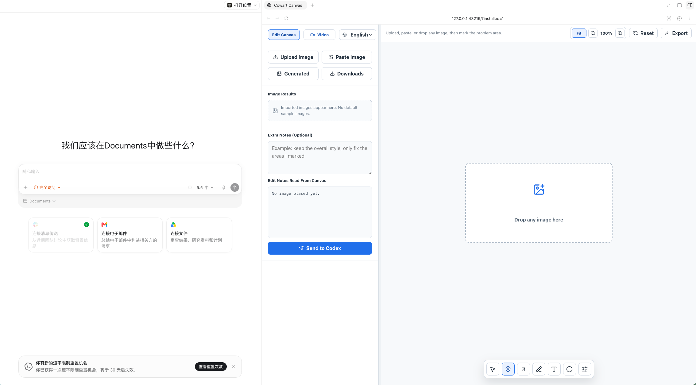
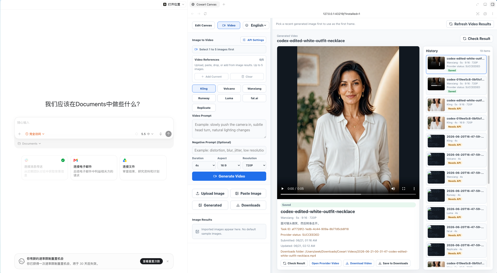
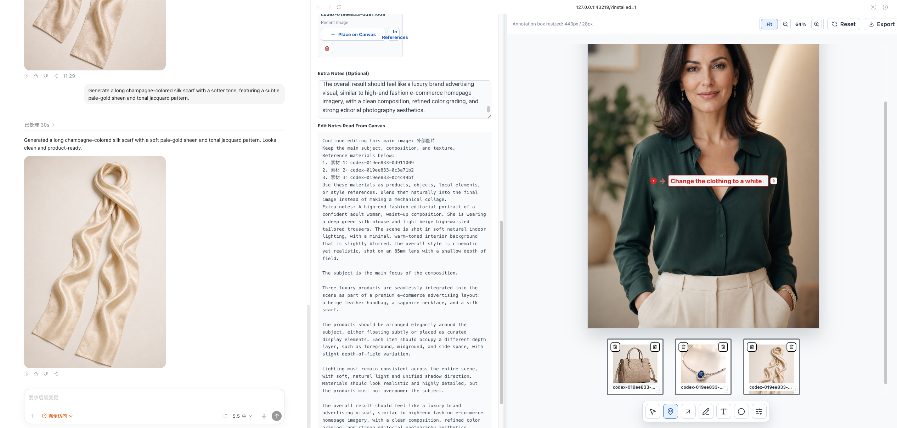
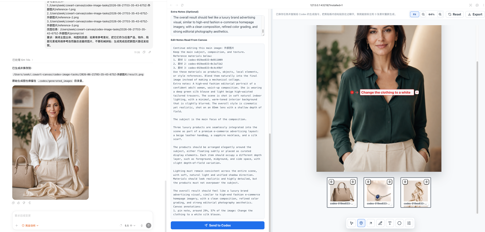
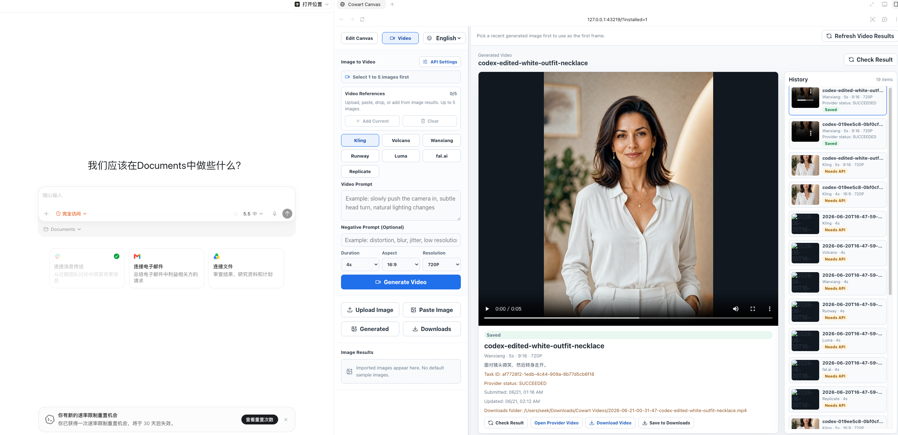

# Cowart Canvas

**Languages:** [English](README.md) | [简体中文](README.zh-CN.md)

Cowart Canvas is a local creative workbench for AI image editing, image generation, image-to-video tasks, product-detail design, and Markdown notes. Its core workflow is simple: put an image on a canvas, mark the exact places that need changes, then turn those visual notes into a Codex-ready edit request or a direct image-edit API call.

The interface is bilingual: Chinese and English are both built in, and users can switch languages from the top-left toolbar.

The app runs on your own machine. Imported images, generated task files, video task files, Markdown notes, backups, and API keys stay local unless you send them to a provider yourself.

## Screenshots

### Demo Video

[Watch or download the image-to-video demo](docs/videos/01-image-to-video-demo.mp4)

### Edit Canvas



### Image To Video



### Reference Canvases And Annotations



### Codex Handoff Workflow



### Video Workflow



## Features

- Upload, paste, drag, or import local images into an edit canvas.
- Use a two-column side panel with `Generated` and `Downloads` quick import buttons.
- `Generated` only lists recent Codex-generated images and local Cowart generated outputs.
- `Downloads` scans the top level of `~/Downloads` and prioritizes likely ChatGPT/OpenAI/DALL-E image downloads.
- Mark image edits with pins, arrows, pen strokes, text, and circles.
- Resize pin/text annotation boxes directly from a subtle bottom-right handle; the text size grows with the box.
- Choose annotation color, shape style, and S/M/L/XL defaults.
- Add up to three extra reference canvases below the main image for product/object/style references.
- Set image Skill / Generation Strategy, prompt, negative prompt, provider, and aspect ratio from the top of the edit side panel.
- Read all canvas notes into a structured Codex edit prompt.
- Send the annotated image task directly to image generation/editing APIs for fal.ai, Alibaba Wanxiang, Volcengine Ark, and Kling.
- Choose image generation aspect ratios such as auto/source, 1:1, 16:9, 9:16, 4:3, 3:4, 3:2, and 2:3.
- Use the standalone Product Detail Generator page to create ecommerce product-detail images from a main product image, reference images, selling points, modules, brand tone, and image APIs.
- Use the standalone Text page for categorized Markdown notes, templates, tags, search, pinned/favorite notes, live preview, code block copy buttons, Markdown export, and local backups.
- Switch the full interface between Chinese and English.
- Create image-to-video tasks from 1 to 5 reference images.
- Configure video provider API keys in the front-end settings panel or `.env.local`.
- View video task history in the right-side canvas area.
- Refresh provider results, preview videos, download videos, and save videos directly to `~/Downloads/Cowart Videos`.

## Requirements

- Node.js 22 or newer
- npm
- A modern Chromium/WebKit/Firefox browser

macOS is recommended for the background service scripts, but the dev server itself is a normal Vite app.

## Quick Start

```bash
git clone https://github.com/yukunai/cowart-canvas.git
cd cowart-canvas
npm install
npm run dev
```

Open:

```text
http://127.0.0.1:43219/?installed=1
```

The `?installed=1` flag is only a compatibility flag for the local browser layout. The app also works at:

```text
http://127.0.0.1:43219/
```

Standalone product-detail image generator:

```text
http://127.0.0.1:43219/product-detail-generator.html
```

Standalone Text page:

```text
http://127.0.0.1:43219/notebook.html
```

Standalone image generation / editing page:

```text
http://127.0.0.1:43219/image-generator.html
```

## macOS Background Service

Install the local LaunchAgent and open the browser app:

```bash
npm run install:mac
```

Open it later:

```bash
npm run open
```

Remove the background service:

```bash
npm run uninstall:mac
```

## How Image Import Works

`Generated` is intentionally narrow. It does not list screenshots, clipboard images, Downloads, Desktop files, or temporary `codex-clipboard-*` images. It only lists:

- `~/.codex/generated_images`
- local Cowart generated image outputs under `codex-image-tasks`

`Downloads` is for images you downloaded from ChatGPT or other tools. It scans `~/Downloads`, sorts by recent files, and gives priority to names that look like ChatGPT/OpenAI/DALL-E image downloads.

The app cannot directly read private images from a ChatGPT conversation in the cloud. Download, copy, paste, or drag the image into Cowart Canvas first.

## Edit Canvas Workflow

1. Import an image with `Upload Image`, `Paste Image`, `Generated`, `Downloads`, or drag-and-drop.
2. Choose a tool from the floating canvas toolbar.
3. Mark the problem area with a pin, arrow, pen, text, or circle.
4. Drag the small bottom-right handle on a text/pin note to enlarge the box and font.
5. Optional: click `Add Canvas` to add one reference slot at a time, up to three.
6. Add notes in `Extra Notes`.
7. Click `Generate/Edit With API` to submit the marked task to a configured image provider, or click `Send to Codex` to export a structured task and copy the Codex instruction.

Generated task files are written under `codex-image-tasks/`. This directory is ignored by git.

## Image API Editing

The edit canvas can submit the current main image, annotations, extra notes, and up to three reference canvases to these image providers:

- fal.ai
- Alibaba DashScope / Wanxiang
- Volcengine Ark
- Kling

Provider keys, model names, and endpoints can be saved from the front-end `Image API Generation` settings panel. If a provider returns an image immediately, Cowart saves it under `codex-image-tasks/` and imports it back into `Image Results`. If a provider only returns a task ID, Cowart stores the provider response and task folder so you can inspect or retry it.

For a simpler page focused only on image generation/editing and visible result history, open:

```text
http://127.0.0.1:43219/image-generator.html
```

The standalone image page supports one source image, up to five reference images, aspect ratio selection, a negative prompt field, and a `Skill / Generation Strategy` selector for strict local editing, portrait identity, reference fusion, style reference, or commercial product imagery. You can also upload custom Skill JSON files, install them into the local browser list, and download the current Skill as a reusable JSON file.

## Text / Markdown Notes

Open:

```text
http://127.0.0.1:43219/notebook.html
```

The Text page is a small local Markdown notebook for prompts, code snippets, edit instructions, planning notes, and reusable workflows. It is intentionally built into Cowart so image/video/design work and written instructions can live beside each other.

Text page features:

- Create categories and rename or delete them from the category context menu.
- Create a new note from the `New Note` button, choose its category, and start from a template.
- Built-in templates include blank notes, code notes, prompt records, project plans, bug records, and meeting notes.
- Search across category names, note titles, note content, and tags. Matching categories expand so the matching notes are visible.
- Add comma-separated tags to each note.
- Right-click a note to pin it or mark it as favorite. Pinned notes stay at the top of their category.
- Use `H1` and `H2` buttons to insert headings. The preview automatically creates a table of contents when there is more than one heading.
- Insert fenced code blocks with a language selector such as JavaScript, TypeScript, Python, Bash, JSON, Markdown, or Text.
- Copy a single rendered code block from the preview with the copy icon.
- Copy the full Markdown note or export it as a `.md` file.
- Drag the left divider to resize the note/category sidebar.
- Click `Backup` to create a local backup copy of all notes.

The browser keeps a local fallback copy, and the dev server writes Markdown notes to:

```text
~/.cowart-canvas/text-notes
```

Manual backups are written to:

```text
~/.cowart-canvas/text-note-backups
```

These note folders are local runtime data and are not committed to the repository.

## Image To Video

The Video panel supports these providers:

- Kling
- Volcengine Ark / Seedance
- Alibaba DashScope / Wanxiang
- Runway
- Luma
- fal.ai
- Replicate

You can select 1 to 5 images as video references. Durations are available from 4s through 15s.

Video task files are written under `video-tasks/`. This directory is ignored by git.

## API Settings

You can configure image and video APIs in two ways.

Option 1: use the app UI:

1. Open `Edit Canvas` for image APIs, or `Video` for video APIs.
2. Click `API Settings`.
3. Select a provider.
4. Fill the keys and optional model/endpoint fields.
5. Save.

Option 2: use `.env.local`:

```bash
cp .env.example .env.local
```

Fill only the providers you want, then restart the dev server or background service.

Never commit `.env.local`.

## Video Downloads

When a provider returns a video URL, you can:

- preview it in the right-side result area
- download it from the browser
- save it directly to:

```text
~/Downloads/Cowart Videos
```

## Verify

```bash
npm run lint
npm run build
```

## Repository Hygiene

The following local/runtime folders are ignored:

- `node_modules`
- `dist`
- `.playwright-cli`
- `codex-image-tasks`
- `video-tasks`
- `text-notes`
- `text-note-backups`
- `.env.local`
- desktop packaging outputs

## License

MIT
